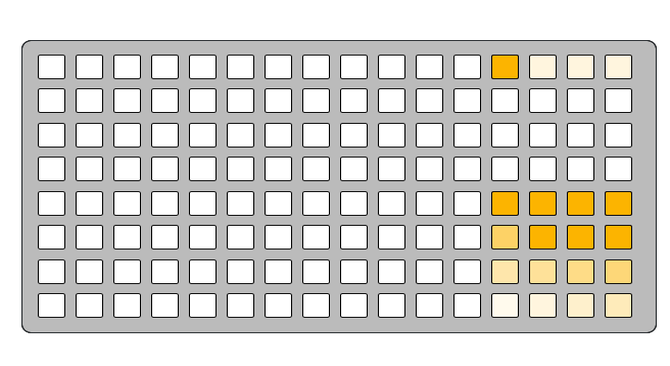
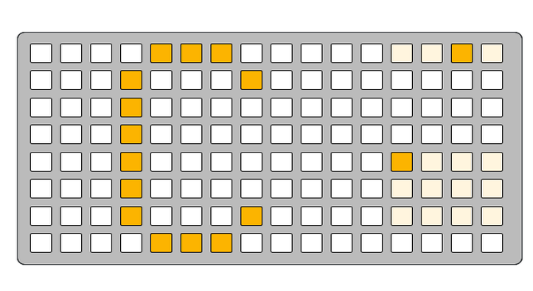
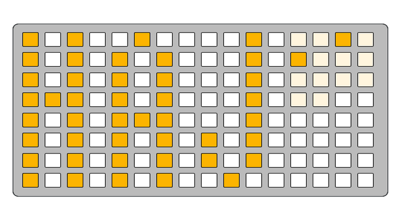
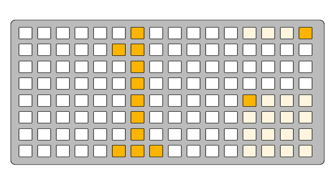
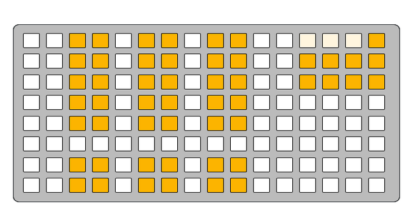

# iiiano User Manual

## Overview

iiiano is a USB MIDI keyboard script for Monome Grid devices that transforms your Grid One or Zero into a versatile musical instrument. The script provides an 8x12 keybed with multiple layout modes, scale selection, velocity control, and comprehensive MIDI functionality.

Watch this comprehensive video tutorial to see iiiano in action:

## Technical Specifications

- **Grid Compatibility**: Monome Grid One (8x16) and Zero (16x16)
- **MIDI Output**: Standard MIDI note on/off messages
- **Velocity Range**: 10-127 (16 discrete levels)
- **Transpose Range**: ±2 octaves
- **MIDI Channels**: 1-16
- **Scales**: 10 predefined scales
- **Layout Modes**: 3 different keybed arrangements

## Prerequisites & Installation

### Hardware Requirements

- Monome Grid One or Zero
- iii firmware version 250114 or newer
- Python 3.11

## How to Install

1. Run `diii` from your commandline of choice
2. Run `^^c` to clear the currently installed script *!This step is important, there is a bug causing issues flashing without a clear first!*
3. Run `u iiiano.lua` to upload the script

## Interface Regions

The Grid interface is divided into three main regions:

| Keybed | Layer | Layer Select |
| - | - | - |
|  |  |  |

## Core Features

### Keybed (Columns 1-12)

The keybed provides a grid-based interface for playing notes with visual feedback.

- **Root Note Highlighting**: Root notes appear at maximum brightness `15`
- **Scale Note Highlighting**: Notes in the current scale appear at medium brightness `6`
- **Same-Note Highlighting**: When a note is pressed, all instances of that note class are highlighted
- **Velocity Feedback**: Pressed keys display brightness corresponding to their velocity value

### Layer Select (Columns 13-16)

The layer selection zone contains three main layers accessible via the top row:

#### Settings Layer Selection

| Position | Function |
|----------|----------|
| `13A` | Performance Layer |
| `14A` | (Reserved) |
| `15A` | Keybed Edit Layer |
| `16A` | MIDI Layer |

## Performance Layer

Access the Performance Layer by pressing `13A`.

### Transpose Control

| Position | Function |
|----------|----------|
| 13B | Transpose up (+1 or +2 octaves) |
| 13C | Reset transpose to 0 |
| 13D | Transpose down (-1 or -2 octaves) |

Current transpose level is indicated by button brightness

### Velocity Control

Static velocity selection with 16 levels ranging from 10 to 127:

| Row | Columns | Velocity Levels |
|-----|---------|-----------------|
| E | 13-16 | Levels 13-16 (highest) |
| F | 13-16 | Levels 9-12 |
| G | 13-16 | Levels 5-8 |
| H | 13-16 | Levels 1-4 (lowest) |

The currently selected velocity blinks between maximum brightness and dim brightness to indicate selection.

## Keybed Layer

Access the Keybed Edit Layer by pressing the button at position 15A.

### Root Note Selection

When selecting a new root note (e.g., F#), the keybed displays the note name.

| Row | Columns 13-16 | Notes |
|-----|---------------|-------|
| E | 13E-16E | C, C#, D, D# |
| F | 13F-16F | E, F, F#, G |
| G | 13G-16G | G#, A, A#, B |

### Scale Selection

When selecting a scale, the keybed displays the an acronym for the scale
Choose from 10 available scales:

| Row | Columns 13-16 | Scales |
|-----|---------------|--------|
| B | 13B-16B | Major, Dorian, Phrygian, Lydian |
| C | 13C-16C | Mixolydian, Minor, Locrian, Natural Minor |
| D | 13D-14D | Harmonic Minor, Melodic Minor |

### Keybed Layout Selection

#### Keybed Layout Modes

| Position | Layout Mode |
|----------|-------------|
| 14H | Octave |
| 15H | 3rds |
| 16H | 4ths |

- **Octave Mode**: Each row represents a full octave (12 semitones)

- **3rds Mode**: Each row is offset by a major third (4 semitones)

- **4ths Mode**: Each row is offset by a perfect fourth (5 semitones)

### In-Key Mode Toggle

| Position | Function |
|----------|----------|
| 13H | Toggle Chromatic/In-Key Mode |

Toggle between:

- **Chromatic Mode**: All notes available
- **In-Key Mode**: Only scale notes available for playing

## MIDI Layer

Access the MIDI Layer by pressing the button at position 16A.

### MIDI Channel Selection

The currently selected channel appears at maximum brightness.

| Row | Columns 13-16 | Channels |
|-----|---------------|----------|
| E | 13E-16E | Channels 1-4 |
| F | 13F-16F | Channels 5-8 |
| G | 13G-16G | Channels 9-12 |
| H | 13H-16H | Channels 13-16 |

### MIDI Panic

Press and hold any button in this area to send MIDI All Notes Off (CC 123) on all 16 MIDI channels. This stops all currently playing notes.

| Area | Function |
|------|----------|
| 13B-16D | MIDI Panic (All Notes Off) |

## Troubleshooting

### No MIDI Output

- Verify MIDI channel selection in MIDI Layer
- Check USB MIDI connections and receiving device settings
- Ensure iii firmware is up to date

### Unexpected Note Layout

- Check current keybed layout mode (octave/3rds/4ths)
- Verify root note selection
- Confirm scale selection matches intended key

### Notes Stuck On

- Use MIDI Panic function in MIDI Layer
- Check for proper note-off messages
- Restart the script if necessary

---

*This manual covers iiiano version as of the script analysis. Features and interface may be updated in future versions.*
